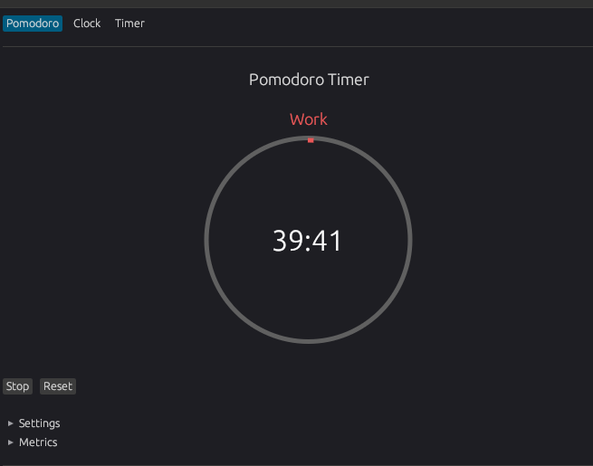

## Pomodoro

A productivity application featuring a pomodoro timer, custom timer, and task management.

<p align="start">
    
</p>

### Features

- Analog and digital clock display
- Customizable Pomodoro timer with work/break cycles
- Custom timer with preset options
- Task list with durations and auto-start functionality
- Backup of tasks to home directory
- Basic productivity metrics

### Installation

1. Clone the repository:

```bash
git clone https://github.com/ThembinkosiThemba/pomodoro.git
cd pomodoro
cargo build
cargo run
```

### Usage

- Switch between tabs using the top navigation bar
- Pomodoro:
  - Click "Start" to begin a work session
  - Add tasks in the task list section
  - Click "Start" on a task to use its duration
  - View metrics under the "Metrics" section
- Timer:
  - Set custom duration using the input fields
  - Use quick-set buttons for common durations
  - Tasks are automatically backed up to ~/.rust_pomodoro_backup/tasks.json

### Controls

- Pomodoro: Start/Stop/Reset buttons
- Timer: Start/Pause/Resume/Reset buttons
- Task List: Add tasks, mark as completed, delete tasks

### Dependencies

- eframe: GUI framework
- egui: Immediate mode GUI library
- chrono: Date and time handling
- serde: Serialization/deserialization
- dirs: Home directory access
